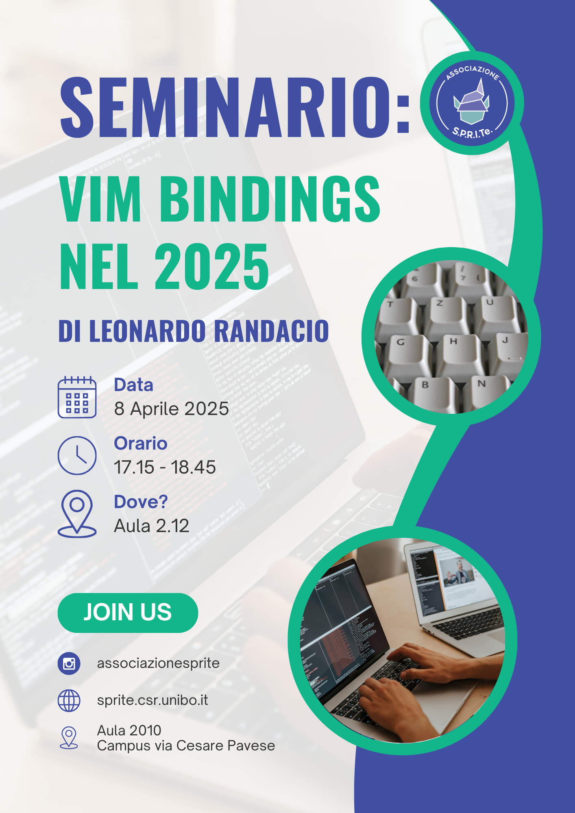

# VimPres

Slides for the seminar that took place at University of Bologna, Campus of Cesena on 8th of April 2025

The seminar was held in italian.



Recordings of the seminar and demo are present at:

- [seminar](https://youtu.be/NxN-hZFqT4Q?si=s5jdknzBXLdbOh-S)
- [demo](https://youtu.be/fTGBNP0iAU0?si=Xue6nOD_2bpspZEV)

A preview of the slides is deployed on [github pages](https://oldranda1414.github.io/vimpres/)

Uses [Marp](https://marp.app/) to turn markdown into slides.

Use the following command to compile slides and open a preview of the slides on the browser:

```sh
./preview.sh
```

Use the following command to compile slides into a pdf file:

```sh
marp --pdf slides.md
```
