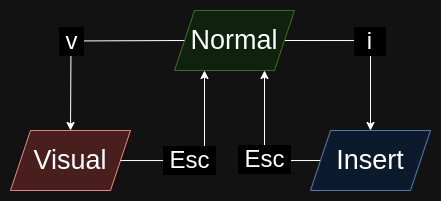
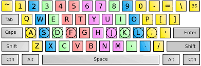

<!--
candidate themes
beam
gaia
uncover
-->

<style>
section::after {
  content: attr(data-marpit-pagination) '/' attr(data-marpit-pagination-total);
}
</style>

<!-- _class: lead -->
<!-- _paginate: false -->

# Vim Bindings Nel 2024

Leonardo Randacio

---

<!-- _paginate: hold -->

## Premessa

Questo seminario __non__ è un tutorial di Vim

Questo seminario è un __introduzione__ ai __Vim Bindings__

__Non dirò:__

-
-

---

<!-- _paginate: hold -->

## Premessa

Questo seminario __non__ è un tutorial di Vim

Questo seminario è un __introduzione__ ai __Vim Bindings__

__Non dirò:__

- come uscire da Vim
-

---

<!-- _paginate: hold -->

## Premessa

Questo seminario __non__ è un tutorial di Vim

Questo seminario è un __introduzione__ ai __Vim Bindings__

__Non dirò:__

- come uscire da Vim
- di smettere di usare il vostro IDE preferito

---

## Prerequisiti

-
-

---

<!-- _paginate: hold -->

## Prerequisiti

- Pazienza
-

---

<!-- _paginate: hold -->

## Prerequisiti

- Pazienza
- Touch Typing

---

## Perché usare i Vim Bindings?

---

<!-- _paginate: hold -->

## Perché usare i Vim Bindings?

- Smettere di usare il __mouse__

---

<!-- _paginate: hold -->

## Perché usare i Vim Bindings?

- Smettere di usare il __mouse__
- Smettere di usare le __arrow keys__

---

<!-- _paginate: hold -->

## Perché usare i Vim Bindings?

- Smettere di usare il __mouse__
- Smettere di usare le __arrow keys__
- Risparmiarsi di imparare __shortcuts__ improponibili

---

## Vim Modes



---

## Vim Modes

Abbiamo __26__ nuovi shortcut!

__52__ se usiamo `\<shift\>`!!!

Vedremo solo i __più utili__

---

## Motions

Al posto delle __arrow keys__:

- ⬆️ → __k__
- ⬇️ → __j__
- ➡️ → __l__
- ⬅️ → __h__

---

<!-- _paginate: hold -->

## Motions

Al posto delle __arrow keys__:

- ⬆️ → __k__
- ⬇️ → __j__
- ➡️ → __l__
- ⬅️ → __h__

### Ehhhhhh?!

---

## Motions



---

## Motions

- __w__ (word), __b__ (back) → destra/sinistra di una parola
- __0__, __$__ → inizio e fine di una riga
- __gg__, __G__ → inizio e fine del file

---

<!-- _paginate: hold -->

## Motions

- __w__ (word), __b__ (back) → destra/sinistra di una parola
- __0__, __$__ → inizio e fine di una riga
- __gg__, __G__ → inizio e fine del file

__Anche con numeri:__

- __2j__ → giù di 2 righe
- __20G__ → vai a riga 20

---

## Operators

- __x__ (cross) → elimina un carattere
- __dd__ (delete) → elimina una riga
- __yy__ (hank) → copia una riga
- __p__ (print) → incolla
- __u__ (undo) → indietro di un azione
- __\<ctrl\> + r__ (redo) → avanti di un azione

---

## Operators

- __i__ (insert) → passa a Insert prima del cursore
- __a__ (append) → passa a Insert dopo il cursore
- __o__ (open) → new line e passa a Insert
- __v/V__ (visual) → passa a character wise/line wise Visual
-
-

---

## Operators

<!-- _paginate: hold -->

- __i__ (insert) → passa a Insert prima del cursore
- __a__ (append) → passa a Insert dopo il cursore
- __o__ (open) → new line e passa a Insert
- __v/V__ (visual) → passa a character wise/line wise Visual
- __I__ → ???
- __A__ → ???

---

## Vim Grammar

_Mangio_ __la mela__

_Verbo_ + __Sostantivo__ → _Operator_ + __Motion__

---

## Vim Grammar

<!-- _paginate: hold -->

_Verbo_ + __Sostantivo__ → _Operator_ + __Motion__

- __dw__ (delete word) → elimina una parola

---

## Vim Grammar

<!-- _paginate: hold -->

_Verbo_ + __Sostantivo__ → _Operator_ + __Motion__

- __dw__ (delete word) → elimina una parola
- __y2l__ (yank 2 right) → copia 2 caratteri a destra

---

## Vim Grammar

<!-- _paginate: hold -->

_Verbo_ + __Sostantivo__ → _Operator_ + __Motion__

- __dw__ (delete word) → elimina una parola
- __y2l__ (yank 2 right) → copia 2 caratteri a destra
- __gU2j__ (go upper 2 down) → rendi maiuscole le prossime 3 righe

---

## Vim Grammar

<!-- _paginate: hold -->

_Verbo_ + __Sostantivo__ → _Operator_ + __Motion__

- __dw__ (delete word) → elimina una parola
- __y2l__ (yank 2 right) → copia 2 caratteri a destra
- __gU2j__ (go upper 2 down) → rendi maiuscole le prossime 3 righe
- __ci(__ (change inner parentheses) → elimina il contenuto della
  parentesi e passa a Insert

---

## Vim Grammar

Il comando più usato:

__.__ (dot) → ripeti l'ultimo comando

---

## Eureka!!!

Proviamo a intuire comandi che non abbiamo mai visto:

```py
print("Hello World") # Questo commento è inutile.
```

---

## Eureka!!!

Proviamo a intuire comandi che non abbiamo mai visto:

Ricorda: __gU__ → rendi maiuscolo

```py
variabile_globale = 1

"""
QUESTO DOVREBBE
ESSERE
TUTTO MINUSCOLO
"""

```

---

## Come Imparare

- Armarsi di __pazienza__
- Installare __estensione__ per il proprio IDE preferito
- Imparare i comandi in maniera __incrementale__
- Chiedersi "posso fare di meglio?"

---

<!-- _class: lead -->
<!-- _paginate: false -->

# Grazie per l'attenzione

Lucidi → https://oldranda1414.github.io/vimpres/
Autore → leonardo.randacio@studio.unibo.it

# __Domande?__

# __Demo?__
